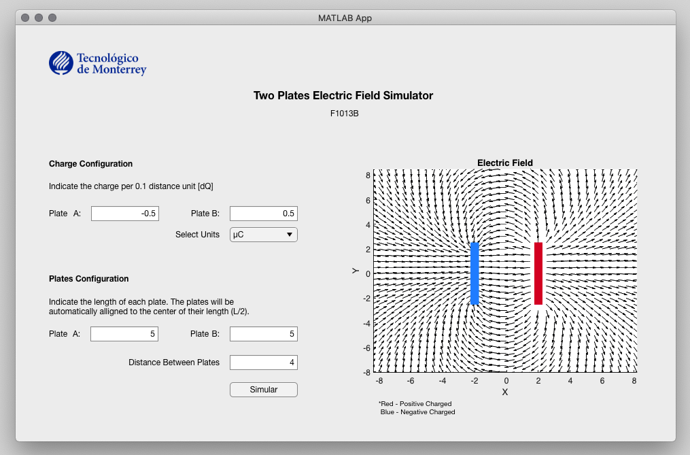

## About The Project

The project was made as a final assignment for “Electric Systems” physics class in which we learned different electric field properties, Gauss law and etc. It has visual interface that one can run using MATLAB, specify the charge per unit distance, units of the charges, size of the rods and distance between them. The rods (or plates) will be aligned automatically to the center ( Length/2). All the calculations are made with a matrix oriented programming that you can inspect in more detail on the separate script file “script.m”. 

App Preview:

## Technical Specifications
This app was made using MATLAB_R2020b version.
